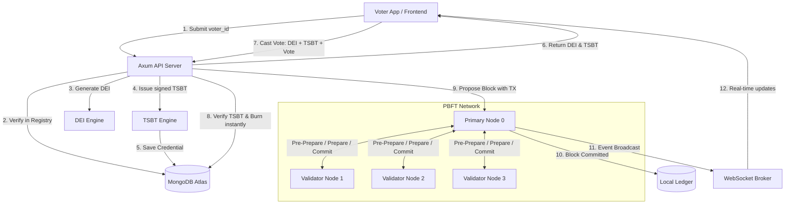

# TSBTChain: A Blockchain-Based Voting System Using Time-Bound Soulbound Tokens

TSBTChain is a custom permissioned blockchain system designed for secure, anonymous, and verifiable electronic voting. It utilizes **Dynamic Election Identities (DEI)** to maintain voter privacy and **Time-Bound Soulbound Tokens (TSBT)** as single-use cryptographically signed voting credentials to prevent double voting.

---

## 🏗️ System Architecture

The following diagram illustrates the flow from voter authentication to vote finalization through the PBFT consensus network:



---

## 🔒 Core Technologies & Protocols

### 1. Dynamic Election Identities (DEI)
To ensure voter anonymity while preventing double voting, TSBTChain generates a one-time dynamic election identity:
$$\text{DEI} = \text{SHA3-512}(\text{Voter ID} \mathbin{\Vert} \text{Election ID} \mathbin{\Vert} \text{Salt})$$
- **Anonymity**: It is cryptographically infeasible to map the DEI back to the original `Voter ID` without the secret salt.
- **Traceability**: Within a single election, the same voter always maps to the exact same DEI, preventing multiple registrations.

### 2. Time-Bound Soulbound Tokens (TSBT)
Voting credentials are model-specific soulbound tokens with built-in expiration:
- **Time-Bound**: They expire automatically after a set duration (e.g., 1 hour) to limit the attack window.
- **Soulbound**: Non-transferable tokens tied directly to the voter's DEI.
- **Atomic Burn**: When a vote is cast, the TSBT status is updated to `Burned` in the database prior to consensus dispatch to block double-voting race conditions.

### 3. Practical Byzantine Fault Tolerance (PBFT) Consensus
A private network of 4 validator nodes coordinates consensus to commit transactions (votes) to the blockchain:
- **Pre-Prepare**: The primary node (Node 0) broadcasts the proposed block containing the transaction.
- **Prepare**: Nodes validate the block structure, index, previous hash, and broadcast prepare votes.
- **Commit**: Once a node receives $2f + 1$ (3) prepare messages, it broadcasts a commit message.
- **Committed**: Upon receiving $2f + 1$ commit signatures, the block is finalized and appended to the ledger.

---

## 📁 Project Structure

```
├── backend/                   # Rust backend service
│   ├── src/
│   │   ├── main.rs            # Axum web server and coordinator
│   │   ├── pbft.rs            # PBFT state machine and peer communication
│   │   ├── blockchain.rs      # Ledger data structures (Block, Transaction)
│   │   ├── db.rs              # MongoDB Atlas client & memory fallback
│   │   ├── tsbt.rs            # Time-Bound Soulbound Token logic
│   │   ├── identity.rs        # DEI engine generator
│   │   ├── crypto.rs          # Ed25519 signatures and SHA3-512 hashing
│   │   └── ws.rs              # Real-time WebSocket event broadcaster
│   └── Cargo.toml
│
└── frontend/                  # React dashboard & visualizer
    ├── src/
    │   ├── App.jsx            # Main app & dashboard layout
    │   ├── components/
    │   │   ├── VoterPortal.jsx # Authentication & voting page
    │   │   ├── AdminPortal.jsx # Election creation & node toggles
    │   │   ├── ConsensusVisualizer.jsx # PBFT network trace visualizer
    │   │   └── Explorer.jsx    # Block & transaction ledger auditor
    │   └── index.css          # Tailwind CSS v4 styling
    └── package.json
```

---

## 🚀 Setup & Execution

### Prerequisites
- [Rust](https://www.rust-lang.org/) (2024 edition supported)
- [Node.js](https://nodejs.org/) (v18+)
- MongoDB Atlas account (or local MongoDB server instance)

### 1. Backend Setup
Create a `.env` file in the `backend/` directory:
```env
MONGODB_URI=your_mongodb_connection_string
```

Run the backend:
```bash
cd backend
cargo run
```

### 2. Frontend Setup
Run the client dev server:
```bash
cd frontend
npm install
npm run dev
```
Open [http://localhost:5173](http://localhost:5173) in your browser.
